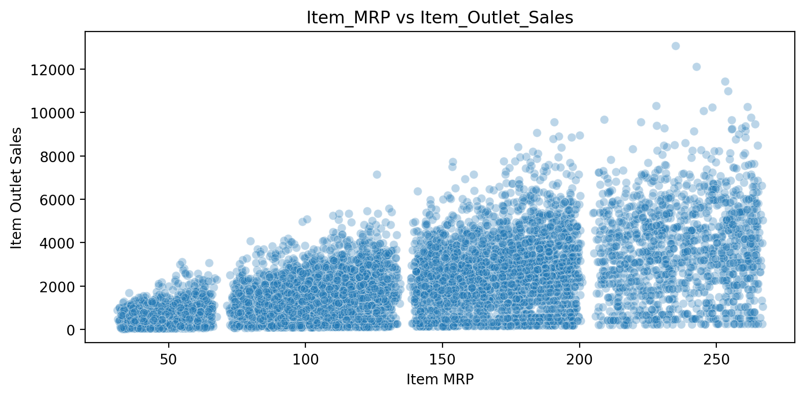
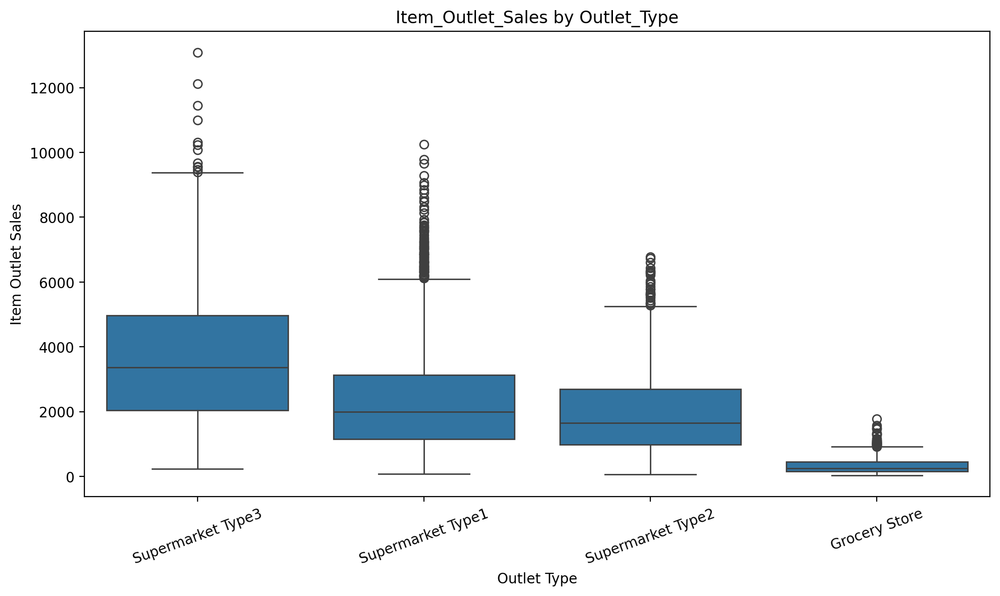
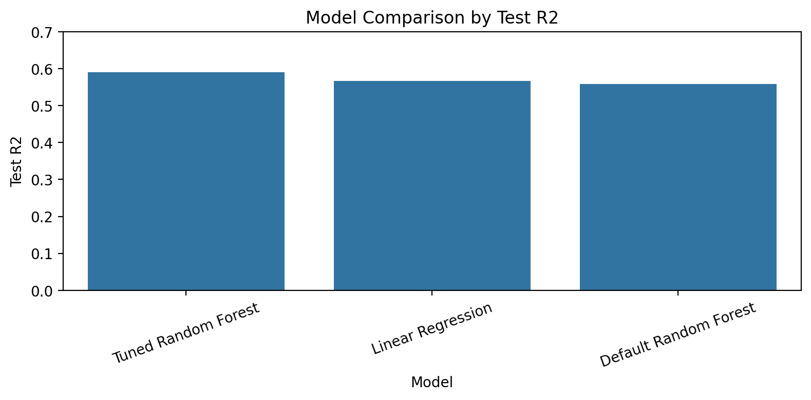

# Product Sales Prediction

## Project Overview

This project uses product and outlet data to predict product sales. The goal is to help a retail business understand which product and store features are most related to sales performance.

The project follows the CRISP-DM process, including data cleaning, exploratory analysis, preprocessing, modeling, evaluation, and deployment preparation.

## Business Problem

Retail businesses need reliable sales predictions to support inventory planning, product placement, and business decision-making.

## Data Insights

### 1. Product price is strongly related to sales

Products with higher maximum retail price generally show higher outlet sales. This suggests that `Item_MRP` is an important predictor of sales performance.

### 2. Outlet type affects sales performance

Sales vary across outlet types. Supermarket outlet types generally perform better than grocery stores, which suggests that store format has an important relationship with sales.

## Model Summary

Several regression models were tested to predict `Item_Outlet_Sales`.

| Model                 | Test R² | Test RMSE | Test MAE |
| --------------------- | ------: | --------: | -------: |
| Tuned Random Forest   |   0.590 |  1063.183 |  738.482 |
| Linear Regression     |   0.567 |  1092.863 |  804.120 |
| Default Random Forest |   0.558 |  1103.878 |  767.302 |

The best model was the **Tuned Random Forest**.

## Final Recommendation

I recommend using the **Tuned Random Forest** model because it had the best overall test performance.

Final test performance:

- Test R²: **0.590**
- Test RMSE: **1063.183**
- Test MAE: **738.482**

R² shows how much variation in sales the model explains. RMSE and MAE are also important because they are measured in the same unit as the target sales value.

## Repository Contents

- `README.md`
- `Product_Sales_Prediction.ipynb`
- `sales_predictions_2023.csv`
- `images/item_mrp_vs_sales.png`
- `images/sales_by_outlet_type.png`
- `images/model_comparison_test_r2.png`

## Tools Used

- Python
- Pandas
- Matplotlib
- Seaborn
- Scikit-learn
- Jupyter Notebook
