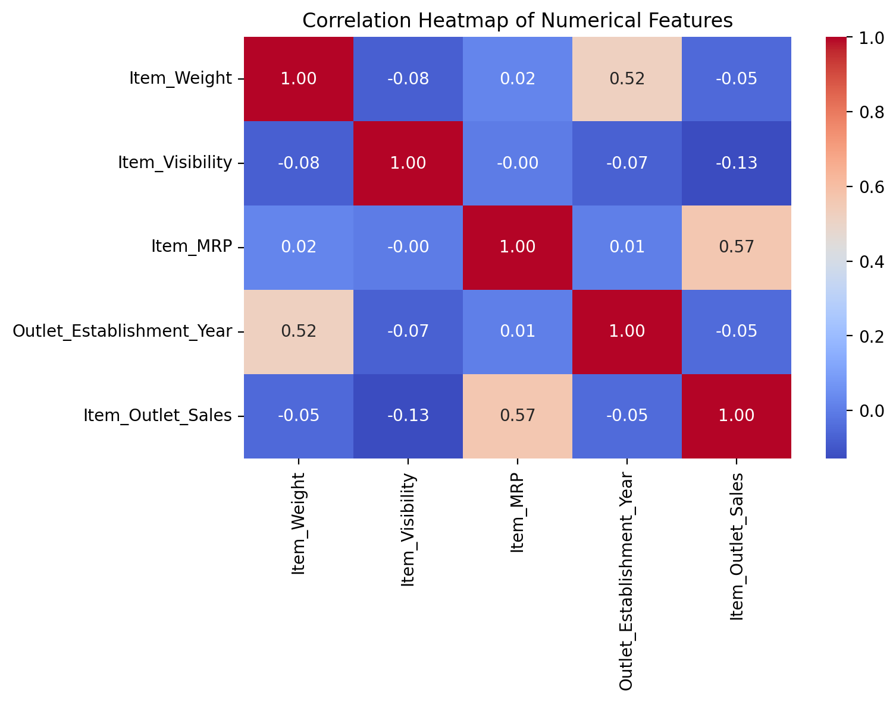

# Prediction of Product Sales

## Project Overview

This project explores sales data for products sold across different outlet types. The goal is to identify patterns in product and store features that may help explain or predict `Item_Outlet_Sales`.

## Dataset

The dataset includes information about product characteristics, outlet characteristics, and the target variable `Item_Outlet_Sales`.

## Data Cleaning Summary

- Removed duplicate rows
- Filled missing values in `Item_Weight` with `0`
- Filled missing values in `Outlet_Size` with `"Missing"`
- Standardized inconsistent categories in `Item_Fat_Content`

## Exploratory Visuals

### 1) Correlation Heatmap

**Interpretation:** `Item_MRP` has the strongest positive relationship with `Item_Outlet_Sales`, which suggests that higher-priced items tend to generate higher sales.

### 2) Item Outlet Sales by Outlet Type

**Interpretation:** Supermarket Type3 outlets show the highest sales overall, while Grocery Stores tend to have much lower sales distributions.

## Key Findings

- `Item_MRP` is the numerical feature most strongly associated with sales.
- Outlet type appears to play an important role in sales performance.
- Some numerical features contain outliers, especially `Item_Outlet_Sales` and `Item_Visibility`.

## Author

Walid Alsafadi
