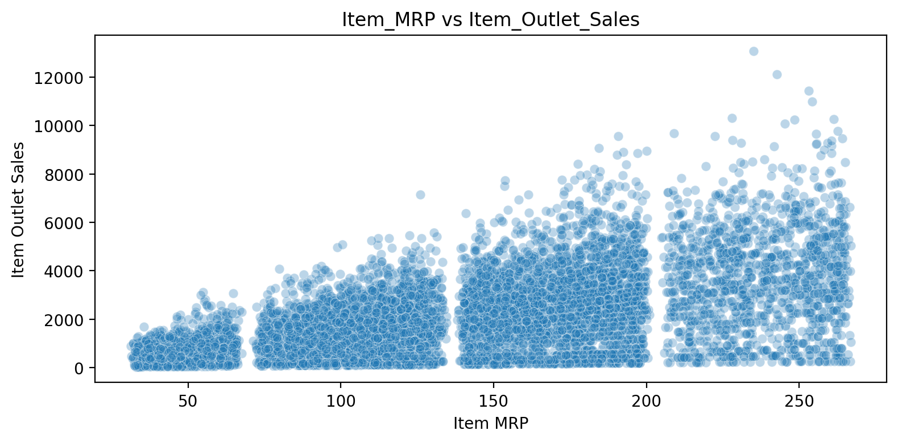
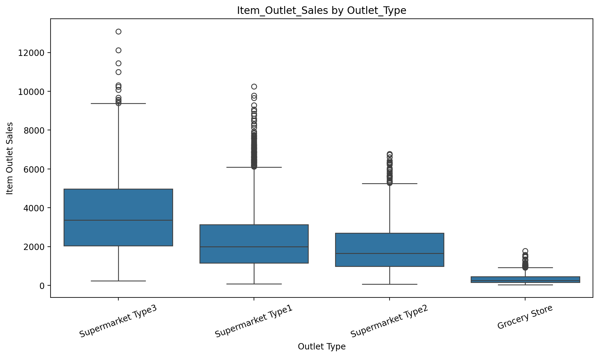
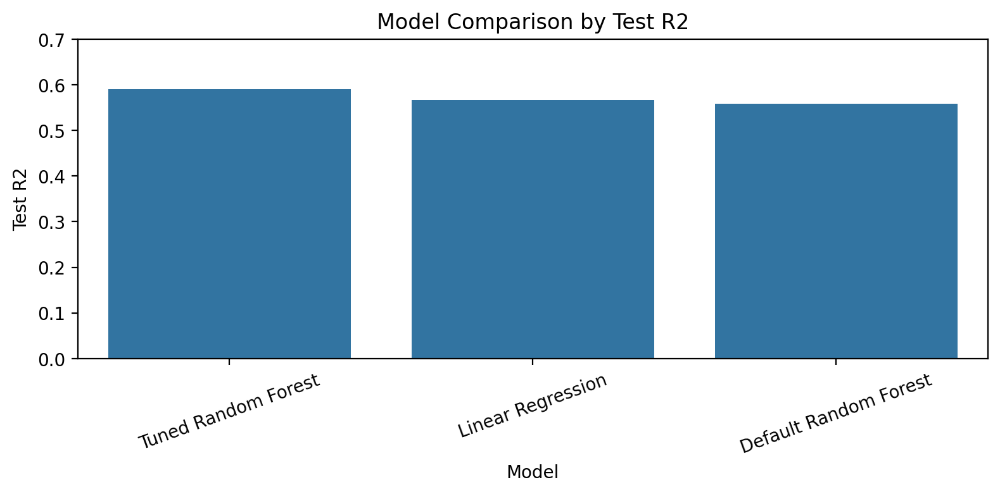
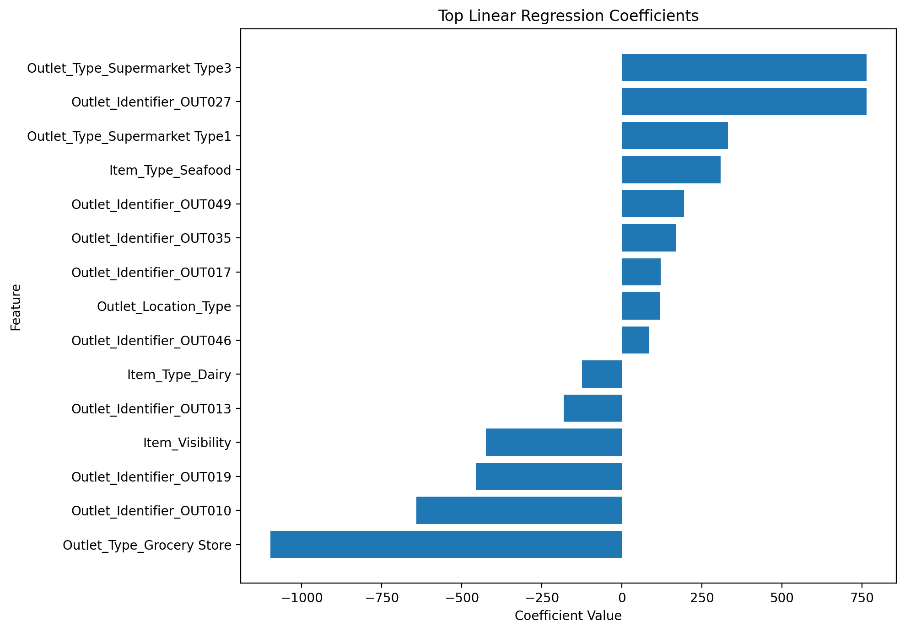
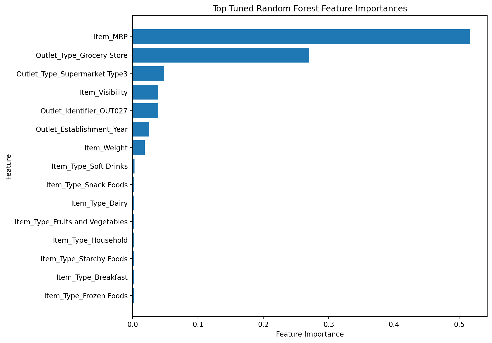

# Product Sales Prediction

## Project Overview

This project uses product and outlet data to predict product sales. The goal is to help a retail business understand which product and store features are most related to sales performance.

The project follows the CRISP-DM process, including data cleaning, exploratory analysis, preprocessing, modeling, evaluation, and deployment preparation.

## Business Problem

Retail businesses need reliable sales predictions to support inventory planning, product placement, and business decision-making.

## Data Insights

### 1. Product price is strongly related to sales

Products with higher maximum retail price generally show higher outlet sales. This suggests that `Item_MRP` is an important predictor of sales performance.

### 2. Outlet type affects sales performance

Sales vary across outlet types. Supermarket outlet types generally perform better than grocery stores, which suggests that store format has an important relationship with sales.

## Model Summary

Several regression models were tested to predict `Item_Outlet_Sales`.

| Model                 | Test R² | Test RMSE | Test MAE |
| --------------------- | ------: | --------: | -------: |
| Tuned Random Forest   |   0.590 |  1063.183 |  738.482 |
| Linear Regression     |   0.567 |  1092.863 |  804.120 |
| Default Random Forest |   0.558 |  1103.878 |  767.302 |

The best model was the **Tuned Random Forest**.

## Model Insights

### Linear Regression Coefficients

The Linear Regression model uses coefficients to show how each feature changes the predicted sales when the other features stay the same. A positive coefficient increases the prediction, while a negative coefficient decreases the prediction.

The top 3 most impactful Linear Regression features were:

| Feature                       | Coefficient | Simple Interpretation                                                                                                                   |
| ----------------------------- | ----------: | --------------------------------------------------------------------------------------------------------------------------------------- |
| Outlet_Type_Grocery Store     |   -1096.484 | Products sold in grocery stores were predicted to have much lower sales than products sold in other outlet types.                       |
| Outlet_Type_Supermarket Type3 |     763.086 | Products sold in Supermarket Type3 outlets were predicted to have much higher sales.                                                    |
| Outlet_Identifier_OUT027      |     763.086 | This outlet had a strong positive relationship with predicted sales, which means the model associated it with higher sales performance. |

### Tree-Based Model Feature Importances

The tree-based model uses feature importance to show which features were most useful for making predictions. Unlike Linear Regression coefficients, feature importance does not show whether a feature increases or decreases sales. It only shows how strongly the model used that feature.

The top 5 most important features in the Tuned Random Forest model were:

| Feature                       | Importance | Simple Interpretation                                                                                  |
| ----------------------------- | ---------: | ------------------------------------------------------------------------------------------------------ |
| Item_MRP                      |      0.517 | Product price was the most important feature for predicting sales.                                     |
| Outlet_Type_Grocery Store     |      0.270 | Whether the outlet was a grocery store strongly affected the model's predictions.                      |
| Outlet_Type_Supermarket Type3 |      0.048 | Supermarket Type3 was important because this outlet type is connected with stronger sales performance. |
| Item_Visibility               |      0.039 | Product visibility helped the model understand how much exposure an item had in the outlet.            |
| Outlet_Identifier_OUT027      |      0.038 | This specific outlet was useful for predicting sales performance.                                      |

These results support the earlier business insights: product price and outlet characteristics are the strongest drivers of predicted sales.

## Final Recommendation

I recommend using the **Tuned Random Forest** model because it had the best overall test performance.

Final test performance:

- Test R²: **0.590**
- Test RMSE: **1063.183**
- Test MAE: **738.482**

R² shows how much variation in sales the model explains. RMSE and MAE are also important because they are measured in the same unit as the target sales value.

## Repository Contents

- `README.md`
- `Product_Sales_Prediction_part8.ipynb`
- `sales_predictions_2023.csv`
- `images/item_mrp_vs_sales.png`
- `images/sales_by_outlet_type.png`
- `images/model_comparison_test_r2.png`
- `images/linear_regression_coefficients.png`
- `images/tree_feature_importances.png`

## Tools Used

- Python
- Pandas
- Matplotlib
- Seaborn
- Scikit-learn
- Jupyter Notebook
